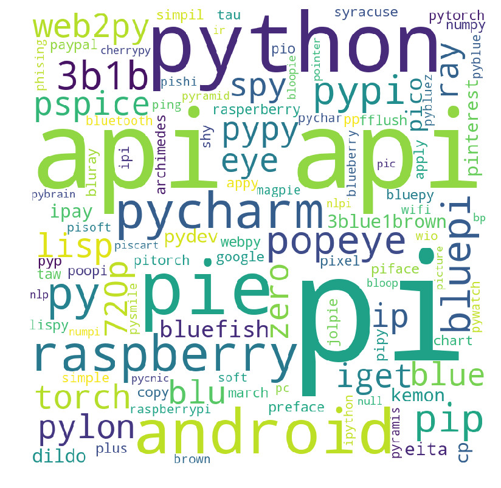
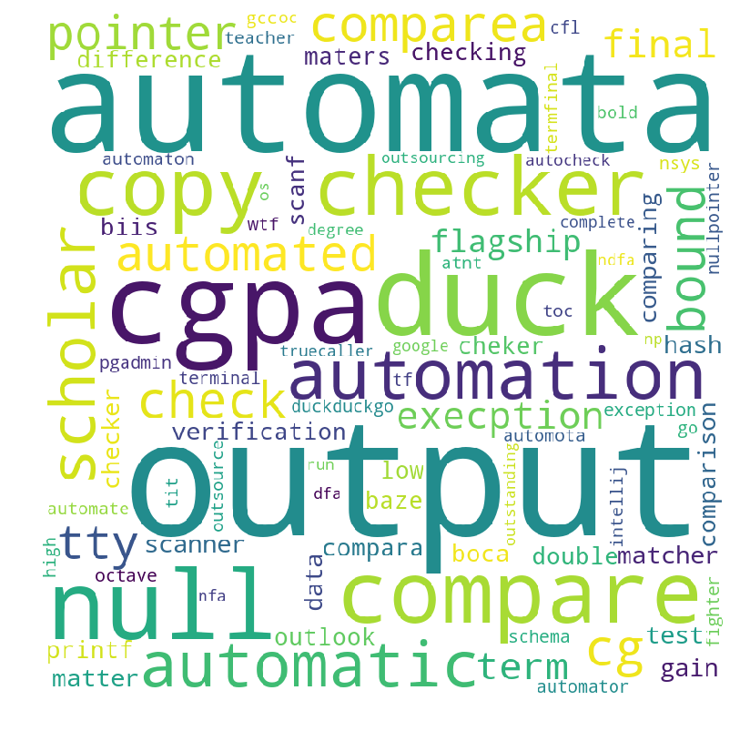
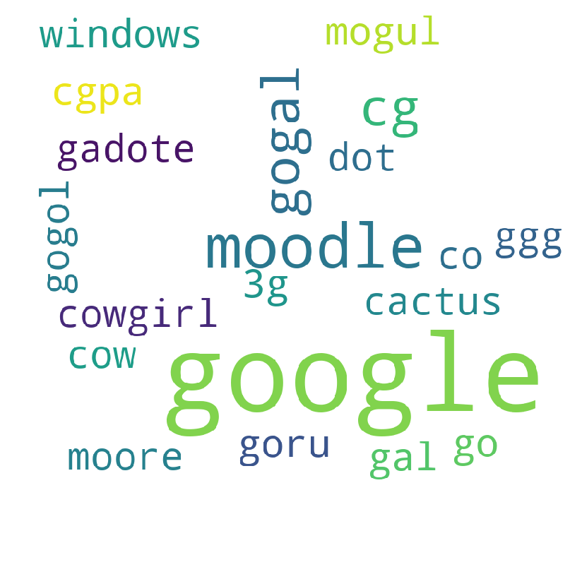
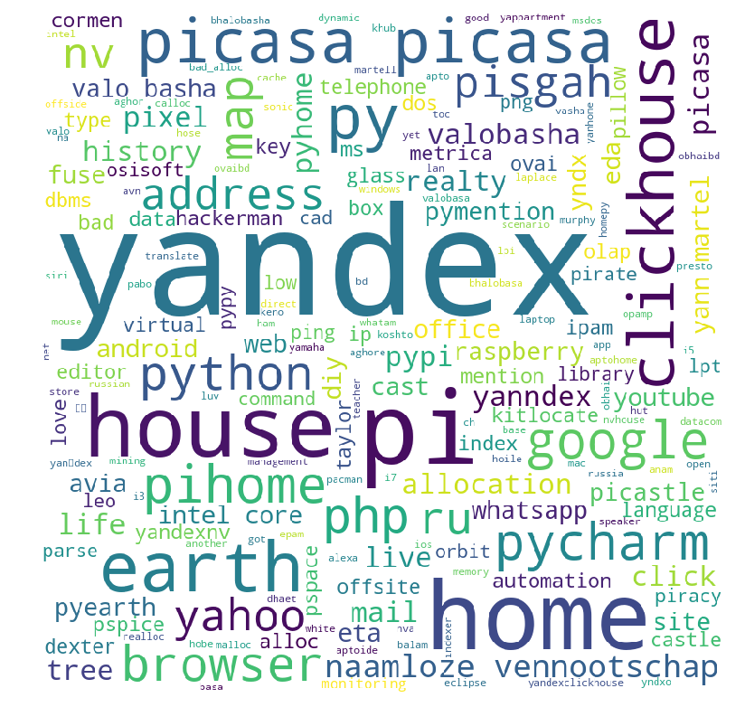

#  Picture Puzzle Wordcloud of Submissions

<!--# ACID-->
<!---->
<!-- -->

# Algorithm

 

# API

 

# Atom

 

# Automata

 

# Cache

 

# Checksum

 

# Cisco

 

# Constructor

 

# Covalentai

 

# DDOS

 

# Debug

 

# Deep learning

 

# ERD

 

# Flask

 

# GCC

 

# Google

 

# ICPC

 

# Instragram

 

# Knuth

 

# Latex

 

# Netbeans

 

# Octal

 

# Picasa

 

# Quora

 

# Race condition

 

# Rational agent

 

# React native

 

# Spyware

 

# Torrent

 

# Vaio

 

# Varchar

 

# Viber

 

# XAMPP

 
